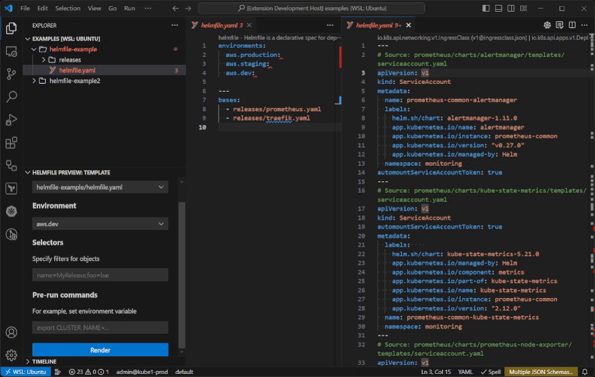

# Helmfile Preview

This extension renders your helmfile with chosen environment.

Generally based on [helm-template-preview-and-more](https://github.com/Nestsiarenka/helm-template-preview-and-more).

## Features

### Run a command

Render currently opened helmfile, or just let it find helmfile and render it.

### Press the button

You can also use a button right in the editor.

### Auto-updated preview

Preview is being updated every time helmfile is saved.

In case you've changed some other connected files except helmfile itself, use sidebar button to update preview.

### Sidebar with settings

If you want to be more precise, you can open a sidebar to choose specific environment and set a selector. Multiple opened workspace folders are supported.

### Validate rendered manifests with kubeconform

Run kubeconform against rendered preview.

### Filters for non-default named helmfiles

You can specify filter for filenames or whole folders in `helmfile-preview.customNameFilter` setting. They will appear in sidebar selector.

Example:

1. `clusters/*staging*.yaml`: Show all files that are in "clusters" folder of workspace root and contain "staging" in filename.
2. `clusters/**.yaml`: Show all files in "cluster" folder, including files in subfolders.

## Requirements

You need to have both [helmfile](https://helmfile.readthedocs.io/en/latest/#installation) and [helm](https://helm.sh/docs/intro/install/) binaries installed in your PATH (or executable specified in settings).

Optional: Install [kubeconform](https://github.com/yannh/kubeconform).

> [!TIP]
> If your helmfile references chart in **private** repository, you need to log in with `helm registry login`.

## Commands

To run any command, open command palette: `Ctrl` + `Shift` + `P` (Windows) / `Shift` + `Command` + `P` (Mac).

* `Helmfile: Render current file preview`: Preview of currently open helmfile in separate tab. Environment will be asked (optional).

* `Helmfile: Find helmfile in workspace and render preview`: Find helmfile in current workspace and open its preview.

## Extension Settings

This extension contributes the following settings:

| **Parameter**                                        | **Description**                                                       | **Default value** |
|------------------------------------------------------|-----------------------------------------------------------------------|-------------------|
| `helmfile-preview.fileNames`                         | Names of files that will be automatically searched as helmfile        | `helmfile`        |
| `helmfile-preview.customNameFilter`                  | Filters for custom Helmfile names (GitIgnore syntax)                  |                   |
| `helmfile-preview.fileExtensions`                    | Extensions of files that are counted as helmfile                      | `*.yaml,*.yml`    |
| `helmfile-preview.environment`                       | Default environment to choose                                         | `default`         |
| `helmfile-preview.kubernetesVersion`                 | Kubernetes cluster version for Kubeconform                            | `1.29.1`          |
| `helmfile-preview.kubeConformStrictValidation`       | Enable strict validation in kubeconform                               | `true`            |
| `helmfile-preview.kubeConformIgnoreMissingSchemas`   | Ignore missing schemas while validation                               | `false`           |
| `helmfile-preview.kubeConformSchemas`                | List of schema locations for kubeconform                              | `default`, `https://raw.githubusercontent.com/datreeio/CRDs-catalog/main/{{.Group}}/{{.ResourceKind}}_{{.ResourceAPIVersion}}.json`         |
| `helmfile-preview.helmfileExecutable`                | Path to `helmfile` executable                                         | `helmfile`        |
| `helmfile-preview.helmExecutable`                    | Path to `helm` executable                                             | `helm`            |
| `helmfile-preview.logLevel`                          | Log level (0..4)                                                      | `1` (Errors only) |

## Contribute

Feel free to open an an issue or make a pull request.

I'm not a typescript programmer, so the code might be inefficient, weird or not-in-the-best-practice-way.

## TODO

* Fix random close of preview sometimes.

## Release Notes

[Changelog](CHANGELOG.md)
