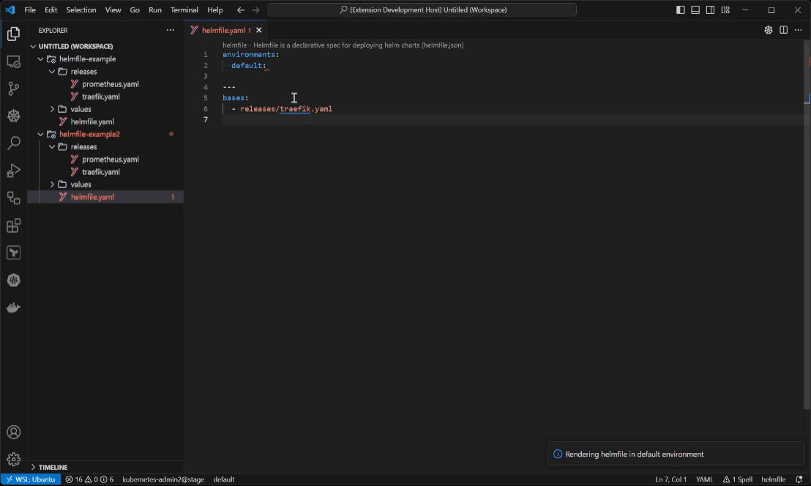
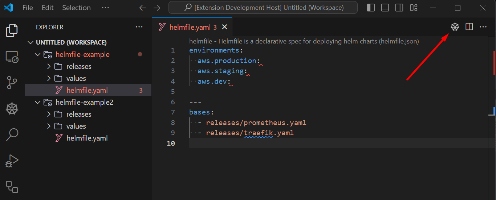
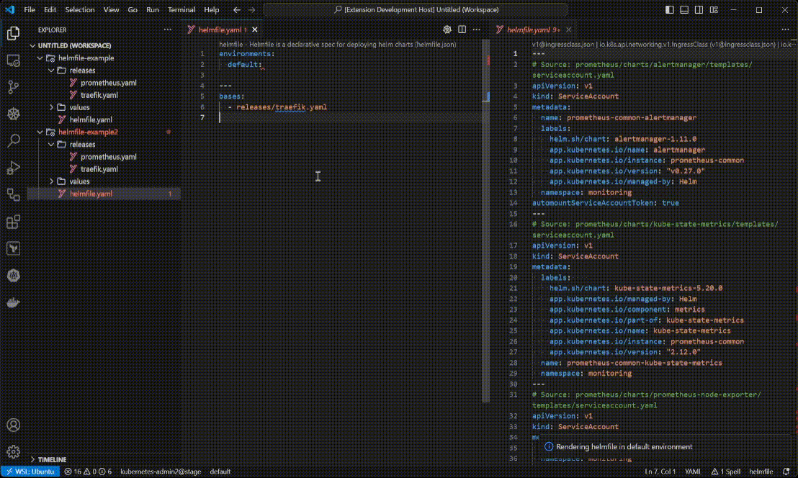
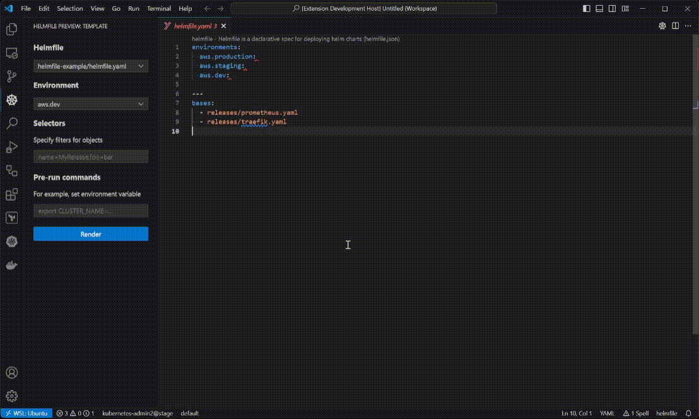

# Helmfile Preview

This extension renders your helmfile with chosen environment.

Generally based on [helm-template-preview-and-more](https://github.com/Nestsiarenka/helm-template-preview-and-more).

## Features

* Render currently opened helmfile, or just let it render the first helmfile it'll find.

* You can also use a button right in the editor.

* Preview is being updated every time helmfile is saved.

* If you want to be more precise, you can open a sidemenu to choose specific environment and set a selector. Multiple opened directories supported.

## Requirements

You need to have both [helmfile](https://helmfile.readthedocs.io/en/latest/#installation) and [helm](https://helm.sh/docs/intro/install/) binaries installed in your PATH (or executable specified in settings).

> TIP: If your helmfile references chart in **private** repository, you need to log in with `helm registry login`.

## Commands

To run any command, open command palette: `Ctrl` + `Shift` + `P` (Windows) / `Shift` + `Command` + `P` (Mac).

* `Helmfile: Render current file preview`: Render currently open helmfile in separate tab.

* `Helmfile: Find helmfile in workspace and render preview`: Find helmfile in current workspace and open its render.

## Extension Settings

This extension contributes the following settings:

| **Parameter**                         | **Description**                                                       | **Default value** |
|---------------------------------------|-----------------------------------------------------------------------|-------------------|
| `helmfile-preview.fileNames`          | Names of files that will be automatically searched as helmfile        | `helmfile`        |
| `helmfile-preview.customNameFilter`   | Filters for custom Helmfile names (GitIgnore syntax)                  |                   |
| `helmfile-preview.fileExtensions`     | Extensions of files that are counted as helmfile                      | `*.yaml,*.yml`    |
| `helmfile-preview.environment`        | Default environment to choose                                         | `default`         |
| `helmfile-preview.helmfileExecutable` | Path to `helmfile` executable                                         | `helmfile`        |
| `helmfile-preview.helmExecutable`     | Path to `helm` executable                                             | `helm`            |

## Contribute

Feel free to open an issue or make a pull request.

I'm not a typescript programmer, so the code might be inefficient, weird or not-in-best-practice-way.

## TODO

## Release Notes

### 1.1.0

* **Feature**: Strip workspace folder from filenames in sidebar selector if there's only 1 opened workspace folder.

* **Feature**: Implement support `gitignore` syntax for custom helmfile names.

You can specify directory or filename masks. Set your masks in configuration.

Example:

1. `clusters/*staging*.yaml`: Use all files that are in "clusters" folder of workspace and contain "staging" in filename.
2. `clusters/**.yaml`: Use all files in "cluster" folder, including files in subdirectories.

### 1.0.2

Fix rendering any files that wasn't rendered before, including non-yaml files

### 1.0.1

Fix images in readme for VSCode Marketplace

### 1.0.0

Initial release of helmfile preview

---
